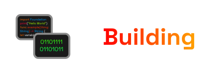

Dependencies:

 * A Swift compiler
 * A C compiler

Most of the heavylifting is done by [the build script](ncctl), so you don't need to do much.

### Building
    $ ./ncctl --build

### Installing
    $ ./ncctl --install --bindir=bin/